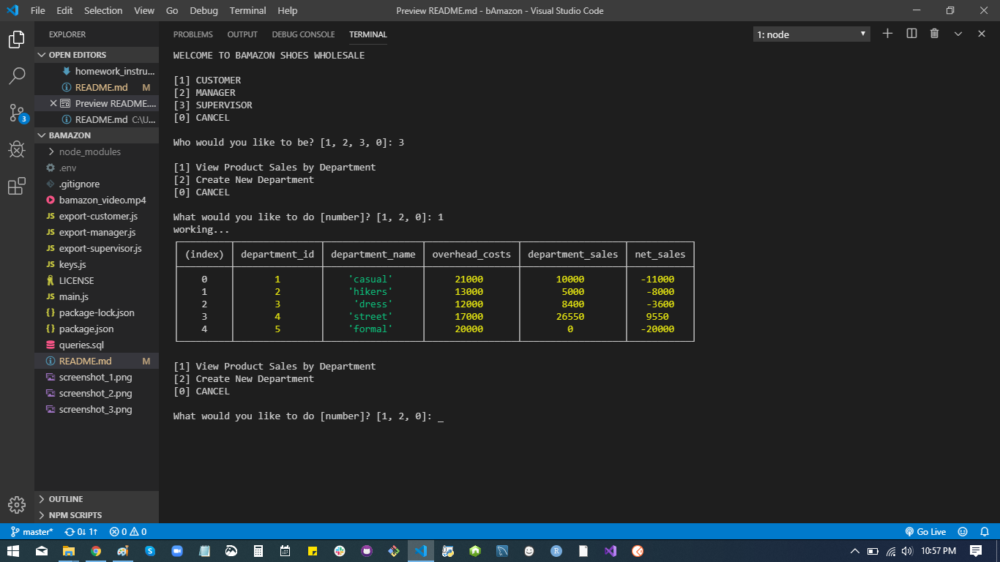

# **bAmazon**
[bAmazon](https://matthew-lorber.github.io/bAmazon/) is a project made for the Rutgers Full Stack Web Developer program. The objective was to create a CLI program using Node.js that manipulates a local database using commands in SQL. The app performs rudimentary tasks as follow:

* Take in orders from customers, and deplete stock from inventory, track sales across departments
* Allow a manager to replenish stock and add new products
* Allow a supervisor to add new departments and view summary data

## Technologies & Languages
<b>Technologies</b>

* [MySQL](https://www.mysql.com) relational database management system
* [Node.js](https://nodejs.org/) runtime environment
* [NPM](https://www.npmjs.com/) package manager for runtime libraries
* [VS Code](https://code.visualstudio.com/) source code editor

<b>Languages</b>

* [Bash](https://gitforwindows.org) Unix shell and command language
* [JavaScript](https://www.javascript.com/) scripting language
* [SQL](https://en.wikipedia.org/wiki/SQL) backend database manipulation

## Standout Features
Rudimentary modularization and key-in-envelope

## Screenshots and Video

If you can't see the video here, download the raw (bamazon_video.mp4) from the repo, or view the published README at https://github.com/matthew-lorber/bAmazon.
<video controls src="./bamazon_video.mp4" width="640" height="480" alt="bamazon_video.webm"></video>

## Code Example
    /* MAIN JAVASCRIPT */
        
    const rl = require('readline-sync');
    console.clear();
    console.log('WELCOME TO BAMAZON SHOES WHOLESALE');

    const view = ['CUSTOMER', 'MANAGER', 'SUPERVISOR'],
        index = rl.keyInSelect(view, 'Who would you like to be? ');

    var selection = view[index];

    if (selection === 'CUSTOMER') {
        const CUSTOMER_MOD = require("./export-customer.js");
        CUSTOMER_MOD.customer();
    }

    if (selection === 'MANAGER') {
        const MANAGER_MOD = require("./export-manager.js");
        MANAGER_MOD.manager();
    }

    if (selection === 'SUPERVISOR') {
        const SUPERVISOR_MOD = require("./export-supervisor.js");
        SUPERVISOR_MOD.supervisor();
    }

## Installation
Examples and explanations about how to get a development env running ::pending::

## How to use?

    $ node main.js

## Credits 
#### Thanks to the instructional staff for 💡 ❤️ 🍩 ☕ 

MIT © [Matthew Lorber](https://github.com/matthew-lorber)
